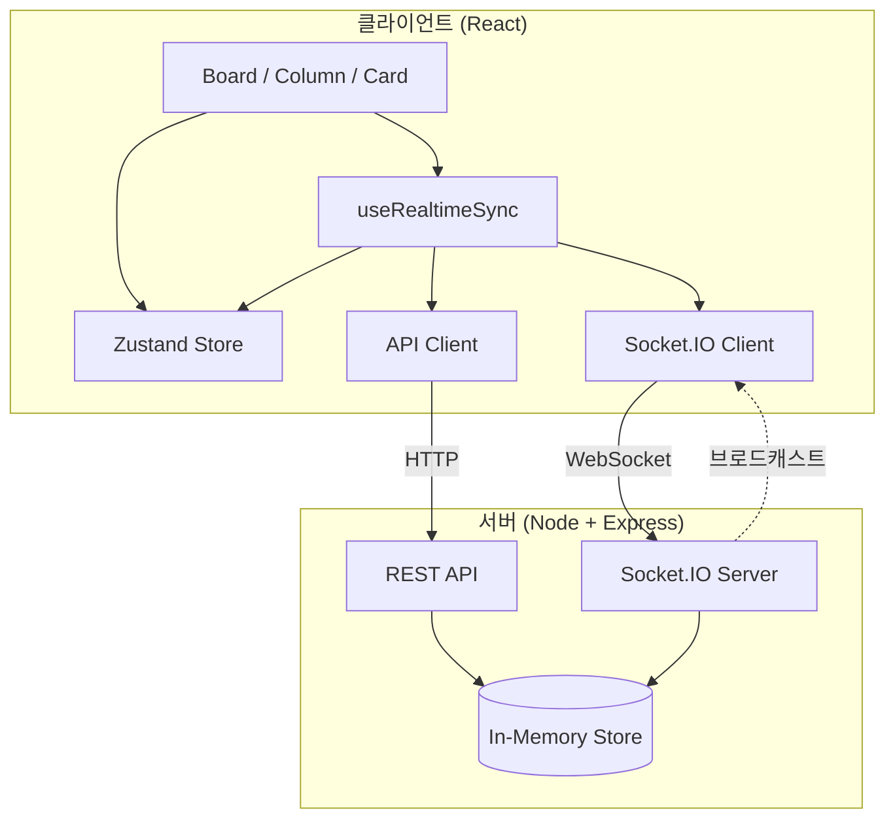

# Realtime Kanban

실시간 협업이 가능한 칸반 보드 웹 애플리케이션입니다. 드래그 앤 드롭으로 카드를 이동하고, WebSocket을 통해 여러 사용자의 변경 사항이 즉시 반영됩니다.

---

## 주요 기능

- **칸반 보드**: Todo / In Progress / Done 3단 컬럼, 카드 CRUD
- **드래그 앤 드롭**: 컬럼 간·컬럼 내 카드 이동 (키보드 접근성 포함)
- **실시간 동기화**: Socket.IO 기반 다중 클라이언트 동기화
- **옵티미스틱 업데이트**: API 응답 전 UI 선반영 후 실패 시 롤백
- **로컬 지속화**: Zustand persist로 새로고침 시 보드 상태 유지
- **접근성**: ARIA 레이블, 키보드 네비게이션, 스크린 리더 고려

---

## 기술 스택

| 영역 | 선택 | 이유 |
|------|------|------|
| **런타임/빌드** | Vite 5, React 18 | Vite: ESM 기반 빠른 HMR·빌드. React 18: 동시성·Suspense 대비. |
| **상태 관리** | Zustand + Immer | 전역 보드 상태를 가볍게 관리. Immer로 불변 업데이트 단순화, persist로 localStorage 연동. |
| **드래그 앤 드롭** | @dnd-kit | 접근성(키보드, 스크린 리더) 내장, React 18 호환, Sortable과 조합해 리스트 재정렬 용이. |
| **실시간** | Socket.IO (client) | 방/네임스페이스·재연결·폴백 지원. 서버와 이벤트 기반 동기화에 적합. |
| **네트워크** | Fetch + REST API | 카드 CRUD는 REST, 실시간 이벤트는 Socket으로 분리해 역할 명확화. |
| **폼/검증** | React Hook Form + Zod | 제목 필수 등 검증을 Zod 스키마로 정의 가능, RHF와 조합해 리렌더 최소화. |
| **스타일** | Tailwind CSS | 유틸리티 기반으로 컴포넌트 단위 스타일링, 다크/반응형 일관화. |
| **테스트** | Vitest + Testing Library | Vite 생태계와 통합, jsdom 대신 happy-dom으로 ESM 호환. RTL로 사용자 행동 중심 검증. |

---

## 아키텍처



**데이터 흐름 요약**

1. **사용자 액션** → Store 즉시 반영(옵티미스틱) → API/Socket 호출
2. **API 성공** → 서버 카드로 교체(replaceCard) 또는 유지, Socket으로 다른 클라이언트에 브로드캐스트
3. **API 실패** → Store 롤백(이전 상태 복원)
4. **다른 클라이언트 이벤트** → Socket 수신 → `applyCardFromServer` / `removeCardFromServer` / `moveCard`로 Store 동기화

---

## 실행 방법

### 사전 요구사항

- Node.js 18+ (권장: 20+)
- npm 9+

### 클라이언트

```bash
npm install
npm run dev
```

개발 서버는 기본적으로 `http://localhost:5173`에서 실행됩니다.

### 서버 (실시간 동기화용)

```bash
cd server
npm install
npm run dev
```

서버는 기본적으로 `http://localhost:3001`에서 실행되며, API와 Socket.IO를 제공합니다.  
클라이언트만 실행해도 보드는 동작하지만, 실시간 동기화와 카드 지속화는 서버가 떠 있어야 합니다.

### Vercel 배포 (클라이언트)

1. [Vercel](https://vercel.com)에 로그인 후 **Add New → Project**에서 이 저장소를 import.
2. **Root Directory**는 프로젝트 루트 그대로, **Build Command** `npm run build`, **Output Directory** `dist` (기본값으로 채워짐).
3. 서버를 별도로 배포한 경우(예: Railway, Render), Vercel 프로젝트 **Settings → Environment Variables**에 추가:
   - `VITE_API_URL`: API 서버 URL (예: `https://your-api.railway.app`)
   - `VITE_SOCKET_URL`: Socket.IO 서버 URL (동일 주소 가능)
4. **Deploy** 실행.

> 서버(Express + Socket.IO)는 Vercel의 서버리스 환경과 맞지 않아, 실시간 기능이 필요하면 Railway·Render·Fly.io 등에 별도 배포 후 위 환경 변수로 연결하면 됩니다.

### 테스트

```bash
npm run test:run        # 단일 실행
npm run test            # watch 모드
npm run test:coverage   # 커버리지
```

---

## 기술적 의사결정

### 1. 실시간 동기화 전략

- **이벤트 종류**: `CARD_CREATED`, `CARD_UPDATED`, `CARD_DELETED`, `CARD_MOVED`를 서버에서 브로드캐스트.
- **자기 액션 중복 방지**: `moveCard` 등 자기 클라이언트가 발생시킨 변경은 `isOwnActionRef`로 이벤트 수신 시 적용을 스킵해, UI가 두 번 바뀌는 것을 막음.
- **Throttle**: Socket emit을 150ms 단위로 제한해, 빠른 드래그/연속 입력 시 서버·네트워크 부하를 줄임.

### 2. 옵티미스틱 업데이트 구현

- **추가**: `tempId`로 카드를 즉시 스토어에 넣고, `api.createCard` 성공 시 `replaceCard(tempId, serverCard)`로 서버 ID/타임스탬프 반영. 실패 시 `removeCardFromServer(tempId)`로 제거.
- **수정/이동/삭제**: 현재 상태를 저장한 뒤 스토어를 먼저 갱신하고, API 실패 시 저장해 둔 값으로 복원.
- **편집 중인 카드**: 다른 클라이언트에서 같은 카드가 수정되면 `CARD_UPDATED` 수신 시 `setEditingCardId(null)`로 편집 모드를 닫아 충돌 감소.

### 3. 성능·UX 관련 포인트

- **디바운스**: 카드 제목/설명 타이핑 시 `useDebouncedCallback`(500ms)으로 API 호출을 한 번만 보내도록 해 입력 끊김과 요청 수를 줄임.
- **컬럼/카드 파생 데이터**: `useMemo`로 `cards` → 컬럼별 정렬 리스트, `activeDragId` → 오버레이용 카드 계산을 캐싱.
- **리스트 렌더**: Card를 `memo`로 감싸고, Column·Board에서 콜백을 `useCallback`으로 고정해 불필요한 리렌더 감소.
- **CSS**: 카드/컬럼에 `contain: layout`을 사용해 드래그 시 리플로우 범위를 제한.

---

## 개선 가능한 점

- **인증/권한**: 현재 사용자·보드별 권한 없음. 추후 JWT·보드 멤버십으로 CRUD/실시간 이벤트 접근 제어 필요.
- **오프라인/재연결**: 네트워크 끊김 시 큐잉·재연결 후 재동기화(충돌 해결 정책 포함) 미구현.
- **E2E 테스트**: Vitest + Testing Library로 단위/통합만 수행. Playwright 등으로 드래그·실시간 동기화 시나리오 자동화 권장.
- **에러 UI**: API 실패 시 토스트/인라인 메시지 등 사용자 피드백이 약함. 전역 에러 바운더리·토스트 도입 시 UX 개선 가능.
- **서버 저장소**: 현재 서버는 인메모리 저장. 프로덕션에서는 PostgreSQL 등 영구 DB + 마이그레이션 전략 필요.
- **defaultProps**: React 19에서 제거 예정이므로, CardForm·Column 등은 default parameters로 이전하는 것이 좋음.

---

## 스크린샷

<!-- TODO: 실제 실행 화면 캡처 후 추가 -->

*실행 화면 캡처를 추가할 예정입니다.*

---

## 라이선스

MIT
